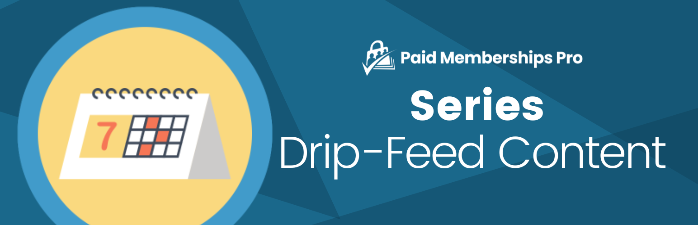

# [Paid Memberships Pro - Series: Drip-Feed Content](https://github.com/strangerstudios/pmpro-series) #
[comment]: # (Generate badges from shields.io, only works for .org plugins to get other stats etc. We'd have to create our own endpoints for Premium plugins)

### Welcome to the Paid Memberships Pro - Series: Drip-Feed Content GitHub Repository
Drip feed content to your members over the course of their membership. Serializes content by # of days post-registration.

For more information please visit [https://www.paidmembershipspro.com/add-ons/pmpro-series-for-drip-feed-content/](https://www.paidmembershipspro.com/add-ons/pmpro-series-for-drip-feed-content/)

## Installation ##
For detailed installation steps, visit the [documentation](https://www.paidmembershipspro.com/add-ons/pmpro-series-for-drip-feed-content/) page.

1. Download the current development ZIP file directly: `https://github.com/strangerstudios/pmpro-series/archive/dev.zip`

**Please ensure that once installing this version of the plugin to remove `-dev` from the plugin's folder name.**

## Bugs ##
If you find an issue/bug, let us know by [creating a detailed GitHub issue](https://github.com/strangerstudios/pmpro-series/issues/new).

## Support ##
This is a developer's portal for Paid Memberships Pro - Series: Drip-Feed Content. We do not offer support on this channel. **Any support related questions should be directed to [paidmembershipspro.com/support](https://www.paidmembershipspro.com/support/).**

## Contributing to Paid Memberships Pro - Series: Drip-Feed Content ##
We encourage and welcome any contribution to Paid Memberships Pro - Series: Drip-Feed Content. Please read the [guidelines for contributing](https://github.com/strangerstudios/pmpro-series/blob/dev/.github/CONTRIBUTING.md) to this repository.

There are various **ways to the help development** of Paid Memberships Pro - Series: Drip-Feed Content:

1. Report [bugs/issues](https://github.com/strangerstudios/pmpro-series/issues/new) on GitHub.
2. Work on any issues by submitting a Pull Request.

Here are some ways for **non-developers to contribute** to Paid Memberships Pro - Series: Drip-Feed Content:

1. Translate Paid Memberships Pro - Series: Drip-Feed Content into your own [language](https://www.paidmembershipspro.com/paid-memberships-pro-in-your-language/).
2. [Purchase a paid membership](https://paidmembershipspro.com/pricing) to help fund ongoing development and bug fixes.
3. Leave an honest review for [Paid Memberships Pro - Series: Drip-Feed Content](https://www.paidmembershipspro.com/submit-testimonial/).